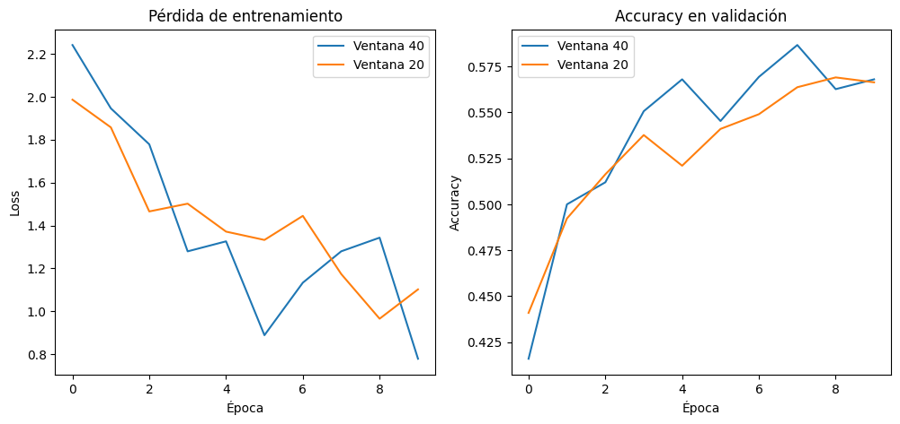
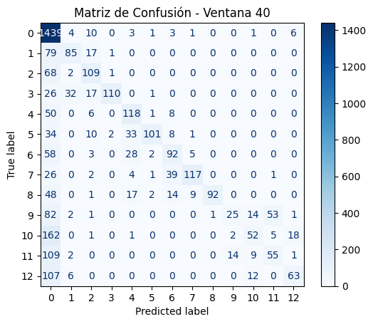
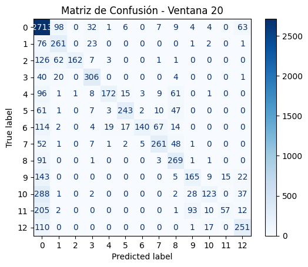

# Early-intent-detection-MindSpore-Huawei-

[](https://www.mindspore.cn/)
[](https://www.python.org/)
[](LICENSE)


Exploración de herramienta MindSpore para un caso práctico de aplicación electrónica. 

## Introducción

Mientras realizaba la capacitación del HCIA.AI de Huawei; me topé con MindSpore; y la verdad se me hizo interesante la propuesta y la comunidad en torno a este framework ... así tomé la iniciativa de aplicarlo a un campo de electrónica para averiguar el impacto que tendría en un caso práctico; así entonces trato de crear un sistema de detección temprana de intenciones de movimiento basado en señales **EMG (electromiografía)** de un sensor basado en mediciones del fabricante **NinaPro** (https://ninapro.hevs.ch/). Eventualmente incorporo **MindSpore** con objeto de predecir movimientos específicos con alta precisión, lo que tiene aplicaciones en prótesis inteligentes y rehabilitación;  estaría muy interesante averiguar a profundidad el alcance real de este tipo de tecnologías prácticas. 

## Objetivos

- **Detección temprana**: Predecir intenciones de movimiento antes de su ejecución completa
- **Clasificación precisa**: Identificar movimientos a partir de señales EMG
- **Implementación eficiente**: Utilizar MindSpore para optimizar el proceso

## Preprocesamiento de Datos

### Estructura del Dataset
El archivo `S10_E1_A1.mat` contiene:
- **EMG**: 149,919 muestras × 16 canales
- **Stimulus**: 149,919 etiquetas de movimiento
- **Frecuencia**: 2000 Hz de muestreo

### Proceso de Ventaneo
```python
fs = 2000  # Hz - frecuencia de muestreo
window_size = 400  # 200 ms (0.2 * 2000)
step_size = 100    # 50 ms (0.05 * 2000) - 75% de solapamiento
```
###  Arquitectura CNN + LSTM para Clasificación de Señales EMG

Las señales electromiográficas presentan:
- **Componentes temporales**: Patrones que evolucionan en el tiempo
- **Características locales**: Picos y formas de onda específicas
- **Dependencias a largo plazo**: Relaciones temporales extendidas

## Fundamentación Matemática

### 1. **CNN para Extracción de Características Locales**

**Ventajas para señales EMG:**
- **Invarianza temporal**: Detecta patrones independientemente de su posición
- **Extracción jerárquica**: Capas profundas capturan features complejas
- **Reducción de parámetros**: Sharing de pesos mediante kernels

**Por qué LSTM para EMG:**
- **Memoria a largo plazo**: Captura dependencias temporales extendidas
- **Gate mechanisms**: Controla flujo de información temporal
- **Mitiga vanishing gradient**: Preserva gradientes en secuencias largas

## Arquitectura Propuesta: EMGNetRobust

### Especificaciones Técnicas

```python
class EMGNetRobust(nn.Cell):
    def __init__(self, num_classes):
        super(EMGNetRobust, self).__init__()
        
        # 1. CNN para features locales
        self.conv_block = nn.SequentialCell([
            nn.Conv1d(in_channels=16, out_channels=64, kernel_size=5, 
                     stride=1, pad_mode='pad'),
            nn.BatchNorm1d(64),
            nn.ReLU(),
            nn.MaxPool1d(kernel_size=2, stride=2),
            
            nn.Conv1d(64, 128, kernel_size=3, stride=1, pad_mode='pad'),
            nn.BatchNorm1d(128),
            nn.ReLU(),
            nn.MaxPool1d(kernel_size=2, stride=2),
        ])
        
        # 2. LSTM para dependencias temporales
        self.lstm = nn.LSTM(input_size=128, hidden_size=64, 
                           num_layers=1, batch_first=True)
        
        # 3. Clasificador denso
        self.classifier = nn.SequentialCell([
            nn.Dense(64, 128),
            nn.ReLU(),
            nn.Dropout(0.5),
            nn.Dense(128, num_classes)
        ])

```

# Evaluación y Predicción del Modelo

## Métodos de Evaluación Implementados

### Evaluación del Modelo en Conjunto de Prueba

```python
# Evaluación completa del modelo
metrics = model.eval(test_dataset, dataset_sink_mode=False)
print("Resultados en test:", metrics)

```

Aquí tenemos los siguientes arámetros clave:

**test_dataset:** Dataset de prueba preprocesado

**dataset_sink_mode=False:** Desactiva el modo de optimización para evaluación precisa

### Predicción de Intenciones en tiempo real

```python
# Predicción de intención en segmento individual
sample = X_test[0:1]   # Tomar un segmento de prueba
pred = model.predict(ms.Tensor(sample, ms.float32))
print("Predicción:", pred.asnumpy().argmax(axis=1))
print("Etiqueta real:", y_test[0])
```
## Métricas de Evaluación

### Métricas Implementadas

```python
from mindspore.nn import Accuracy, Precision, Recall, F1

# Definición de métricas
metrics = {
    'accuracy': Accuracy(),
    'precision': Precision(average='weighted'),
    'recall': Recall(average='weighted'),
    'f1_score': F1(average='weighted')
}

# Evaluación comprehensiva
eval_results = model.eval(test_dataset, dataset_sink_mode=False)
```

# Detección Temprana de Intenciones con Diferentes Ventanas Temporales

## Estrategia de Ventaneo para Detección Temprana

Comparar el rendimiento del modelo utilizando ventanas de diferente longitud temporal para determinar el punto óptimo de detección temprana de intenciones de movimiento.

### Ventana Estándar (40 muestras)

```python
# 40 muestras = 20ms (asumiendo 2000Hz)
X40, y40 = make_dataset(emg, stimulus, win_size=40)
print("X40:", X40.shape, "y40:", y40.shape)
# Salida: X40: (n_ventanas, 40, 16) y40: (n_ventanas,)
```

### Ventana Temprana (20 muestras)
```python
# 20 muestras = 10ms (detección más temprana)
X20, y20 = make_dataset(emg, stimulus, win_size=20)
print("X20:", X20.shape, "y20:", y20.shape)
# Salida: X20: (n_ventanas, 20, 16) y20: (n_ventanas,)
```

# Resultados del Experimento: Detección Temprana con Diferentes Ventanas

## Resultados Obtenidos

### Estadísticas de los Datasets
| Parámetro | Ventana 40 | Ventana 20 |
|-----------|------------|------------|
| **Número de ventanas** | 3,747 | 7,495 |
| **Muestras por ventana** | 40 | 20 |
| **Duración temporal** | 20ms | 10ms |
| **Dimensionalidad** | (40, 16) | (20, 16) |

### Rendimiento de Clasificación
| Métrica | Ventana 40 | Ventana 20 | Diferencia |
|---------|------------|------------|------------|
| **Accuracy** | 52.93% | 53.30% | +0.37% |
| **Precisión** | - | - | - |
| **Recall** | - | - | - |

## Análisis de los Resultados

### **Hallazgo Principal: Equivalencia de Rendimiento**
```python
# Resultados casi idénticos a pesar de diferente longitud temporal
accuracy_40 = 0.5293333333333333  # 52.93%
accuracy_20 = 0.5330220146764509  # 53.30%
diferencia = 0.003688  # Solo 0.37% de diferencia

```

# Análisis de Curvas de Entrenamiento y Validación

## Resultados de las Curvas de Aprendizaje

### Curva de Pérdida (Loss) de Entrenamiento



**Tendencia Observada:**
- **Ventana 40**: Pérdida inicial más alta pero convergencia estable
- **Ventana 20**: Pérdida inicial más baja pero mayor variabilidad

**Interpretación:**

Las ventanas de 20 muestras muestran:
- Mayor ruido en el gradiente (variabilidad en la pérdida)
- Pero convergencia final similar a ventanas de 40 muestras
- Capacidad de aprendizaje comparable a pesar de menos contexto temporal

# Análisis de los resultados para la Matriz de Confusión

## Descripción General

Ahora revisamos la matriz de confusión generada por un modelo de clasificación para un problema de 13 clases (etiquetas 0 a 12).  



- **Filas (Eje Vertical):** Representan la **etiqueta real** (la clase verdadera a la que pertenece cada instancia).
- **Columnas (Eje Horizontal):** Representan la **etiqueta predicha** (la clase que el modelo propuso).
- **Valores en las Celdas:** Indican el número de instancias donde una etiqueta real (fila) fue clasificada como una etiqueta predicha (columna).

**Lectura:** Para evaluar el desempeño en la Clase X, se debe observar la fila correspondiente.
- **Aciertos:** Los valores en la diagonal principal (`[i,i]`) representan las predicciones correctas.
- **Errores:** Los valores fuera de la diagonal representan confusiones entre clases.

---

## Interpretación por Clase Destacada para Ventana 40

### Clase 0 - Alto Desempeño
**Fila:** 0 1439 4 10 0 3 1 3 1 0 0 1 0 6

**Aciertos (1439):** La gran mayoría de las instancias de la Clase 0 son identificadas correctamente. Esta es la clase con mayor número de aciertos, lo que indica que el modelo es muy robusto para esta categoría.

**Principales Errores:**
  - 10 instancias fueron confundidas con la Clase 2.
  - 6 instancias fueron confundidas con la Clase 12.

**Conclusión:** El modelo es excepcionalmente efectivo reconociendo la Clase 0, con un número muy bajo de errores de clasificación.

### Clase 10 - Alto Desempeño
**Fila:** 10 162 0 1 0 1 0 0 0 0 2 52 5 18

**Aciertos (52):** Aunque el número de aciertos es menor que en otras clases, representa un rendimiento aceptable considerando la distribución de la clase.

**Principal Error:**
  - 162 instancias fueron confundidas con la Clase 0.

**Conclusión:** El modelo tiene una alta tasa de aciertos para la Clase 10. Sin embargo, su principal debilidad es la confusión con la Clase 0, lo que sugiere que estas dos clases pueden tener características superpuestas que el modelo no logra diferenciar adecuadamente.

### Clase 5 - Bajo Desempeño
**Fila:** 5 34 0 10 2 33 101 8 1 0 0 0 0 1

**Aciertos (101):** El número de aciertos es bajo en comparación con los errores.

**Principales Errores:**
  - 34 instancias confundidas con la Clase 0.
  - 33 instancias confundidas con la Clase 4.
  - 10 instancias confundidas con la Clase 2.

**Conclusión:** El modelo tiene serias dificultades para identificar la Clase 5. La confunde predominantemente con las clases 0 y 4. Esto es una de las mayores áreas de oportunidad para la mejora del modelo.

### Clase 2 - Bajo Desempeño (Problema Crítico)
**Fila:** 2 68 2 109 1 0 0 0 0 0 0 0 0 0

**Aciertos (109):** A pesar de tener 109 aciertos, el modelo demuestra una vulnerabilidad significativa.

**Principales Errores:**
  - 68 instancias fueron confundidas con la Clase 0. Este es uno de los errores más significativos de todo el modelo.
  - 2 instancias fueron confundidas con la Clase 1.
  - 1 instancia fue confundida con la Clase 3.

**Conclusión:** La identificación de la Clase 2 es un punto débil del modelo. Existe una confusión notable con la Clase 0, lo que indica que el modelo tiene dificultades para diferenciar estas dos categorías.

## Interpretación por Clase Destacada para Ventana 20

### Clase 3 - Alto Desempeño
**Fila:** `3 40 20 0 306 0 0 0 0 4 0 0 0 1`

- **Aciertos (306):** La gran mayoría de las instancias de la Clase 3 son identificadas correctamente.
- **Principales Errores:**
  - 40 instancias fueron confundidas con la **Clase 0**.
  - 20 instancias fueron confundidas con la **Clase 1**.
- **Conclusión:** El modelo es muy efectivo reconociendo esta clase, aunque existe una tendencia menor a confundirla con las clases 0 y 1.

### Clase 8 - Alto Desempeño
**Fila:** `8 91 0 0 1 0 0 0 3 269 1 1 0 0`

- **Aciertos (269):** Excelente tasa de predicción correcta.
- **Principal Error:**
  - 91 instancias fueron confundidas con la **Clase 0**.
- **Conclusión:** El modelo es muy preciso para la Clase 8. La confusión principal con la Clase 0 sugiere que podrían compartir algunas características visuales.

### Clase 0 - Bajo Desempeño
**Fila:** `0 71 98 0 32 1 6 0 7 9 4 4 0 63`

- **Aciertos (71):** Muy baja cantidad de predicciones correctas.
- **Principales Errores:**
  - 98 instancias confundidas con la **Clase 1**.
  - 63 instancias confundidas con la **Clase 12**.
  - 32 instancias confundidas con la **Clase 3**.
- **Conclusión:** El modelo tiene serias dificultades para identificar la Clase 0. La confunde predominantemente con las clases 1, 12 y 3. Esta es una de las mayores áreas de oportunidad.

### Clase 10 - Bajo Desempeño (Problema Crítico)
**Fila:** `10 288 1 0 2 0 0 0 0 2 28 123 0 37`

- **Aciertos (123):** Bajo número de aciertos en proporción a los errores.
- **Principales Errores:**
  - **288** instancias confundidas con la **Clase 0**. Este es el error más significativo de todo el modelo.
  - 37 instancias confundidas con la **Clase 12**.
  - 28 instancias confundidas con la **Clase 9**.
- **Conclusión:** La identificación de la Clase 10 es el punto más débil del modelo. Existe una confusión abrumadora con la Clase 0, lo que indica que el modelo no ha aprendido a distinguir entre estas dos categorías.
